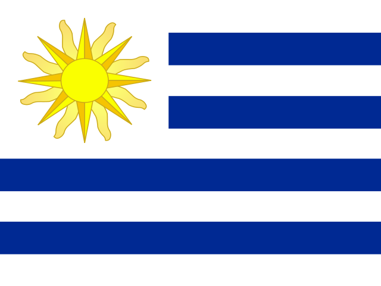

 

### About Me
I am a Software Engineering student and programming enthusiast. 

<code></code>
<code></code>
<code></code>
<code></code>
<code></code>
  

|  |  |
| ------------- | ------------- |

### Interests

- Cryptography
- Blockchain
- Artificial intelligence
- Web design
- Game making
- Digital drawing
- Designing

Visit my [Webpage](https://esmegl.github.io/software-portfolio)
